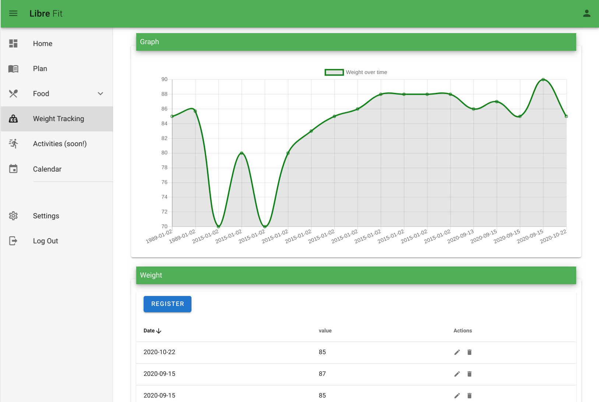

# LibreFit: Open Source calorie counter, diet plan and exercise tracker

LibreFit is a server-based application for count calories, plan diets and track exercise:

 - Written in Go (Golang) and NuxtJS.
 - Free, open source and self-hosted
 - SQlite as a database engine (PostgreSQL coming soon!)
 - It uses [Open Food Facts](https://world.openfoodfacts.org/) as food product database
 - Privacy first: all your data in a single file (`librefit.db`), you own it and nobody is reselling it.
 - Super simple installation

Official website: https://libre.fit 

## Screenshots



## Getting Started

### docker

Small container (<50MB) 

```
$ docker run -it -p 4000:4000 -v $(pwd):/librefit/data librefit/librefit:latest
```

Initially, it'll generate SQlite file `librefit.db` containing all your data.

### docker-compose

```
$ docker-compose build
$ docker-compose up
```

Initially, it'll generate SQlite file `librefit.db` containing all your data.

## NOTICE

LibreFit is **PRE-ALPHA** version. Please do not use it yet.

## Contributing

1. Fork it
2. Clone develop: `git clone -b develop https://github.com/librefit/librefit`
3. Create your feature branch: `git checkout -b new-feature`
4. Make changes and add them: `git add .`
5. Commit: `git commit -m "Add some feature"`
6. Push: `git push origin new-feature`
7. Pull request

## Roadmap

- Exercise tracking
- MindFit to measure and happiness level tracking
